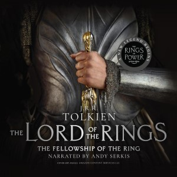
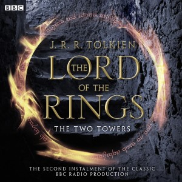
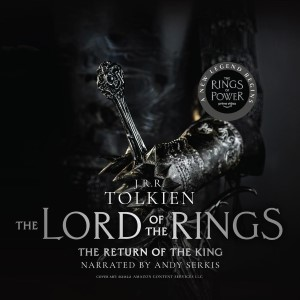

Audio media is perfect for learning to tune your ear to English. Rewind, repeat, and skip ahead as much as you want with these audio mediums. You can go back and hear a word or phrase infinitely to make sure you understood it and can repeat it aloud yourself.

<!--more-->

There are millions of audiobooks in English to choose from, but not all of them are suitable for people who are still learning to understand spoken English. When choosing an audiobook, you can consider the genre, whether you want something light or dramatic, and if you want to learn something or just enjoy a story.

I would like to recommend ***The Lord of the Rings Series*** by *J.R.R. Tolkien*, narrated by *Michael Hordern* etc., the greatest fantasy epic of our time, which begins with *The Fellowship of the Ring* and continues in *The Two Towers* and *The Return of the King*.


  
    
    
<strong>Sample:</strong>

    <audio controls src="https://samples.audible.com/rt/bbcw/001746/rt_bbcw_001746_sample.mp3"></audio>
  
  
    {}
## The Fellowship of the Ring (Book 1)

By: *J.R.R Tolkien*  
Narrated by: *Ian Holm*, *Michael Hordern*, *John Le Mesurier*, *full cast*  
Length: 4 *hrs* and 35 *mins*

Begin your journey to Middle-earth.

The dark, fearsome Ringwraiths are searching for a Hobbit. Frodo Baggins knows that they are seeking him and the Ring he bears—the Ring of Power that will enable evil Sauron to destroy all that is good in Middle-earth. Now it is up to Frodo and his faithful servant, Sam, with a small band of companions, to carry the Ring to the one place it can be destroyed: Mount Doom, in the very center of Sauron’s realm.
    {}
  



  
    
    
<strong>Sample:</strong>

    <audio controls src="https://samples.audible.com/rt/bbcw/001747/rt_bbcw_001747_sample.mp3"></audio>
  
  
    {}
## The Two Towers (Book 2)

By: *J.R.R Tolkien*  
Narrated by: *Ian Holm*, *Michael Hordern*, *John Le Mesurier*, *full cast*  
Length: 4 *hrs* and 29 *mins*

Begin your journey to Middle-earth.

The Fellowship is scattered. Some brace hopelessly for war against the ancient evil of Sauron. Others must contend with the treachery of the wizard Saruman. Only Frodo and Sam are left to take the One Ring, ruler of the accursed Rings of Power, to be destroyed in Mordor, the dark realm where Sauron is supreme. Their guide is Gollum, deceitful and obsessive slave to the corruption of the Ring.
    {}
  



  
    
    
<strong>Sample:</strong>

    <audio controls src="https://samples.audible.com/rt/bbcw/001748/rt_bbcw_001748_sample.mp3"></audio>
  
  
    {}
## The Return of the King (Book 3)

By: *J.R.R Tolkien*  
Narrated by: *Ian Holm*, *Michael Hordern*, *John Le Mesurier*, *full cast*  
Length: 3 *hrs* and 10 *mins*

Begin your journey to Middle-earth.

While the evil might of the Dark Lord Sauron swarms out to conquer all Middle-earth, Frodo and Sam struggle deep into Mordor, seat of Sauron’s power. To defeat the Dark Lord, the One Ring, ruler of the accursed Rings of Power, must be destroyed in the fires of Mount Doom. But the way is impossibly hard, and Frodo is weakening. Weighed down by the compulsion of the Ring, he begins finally to despair.
    {}
  

